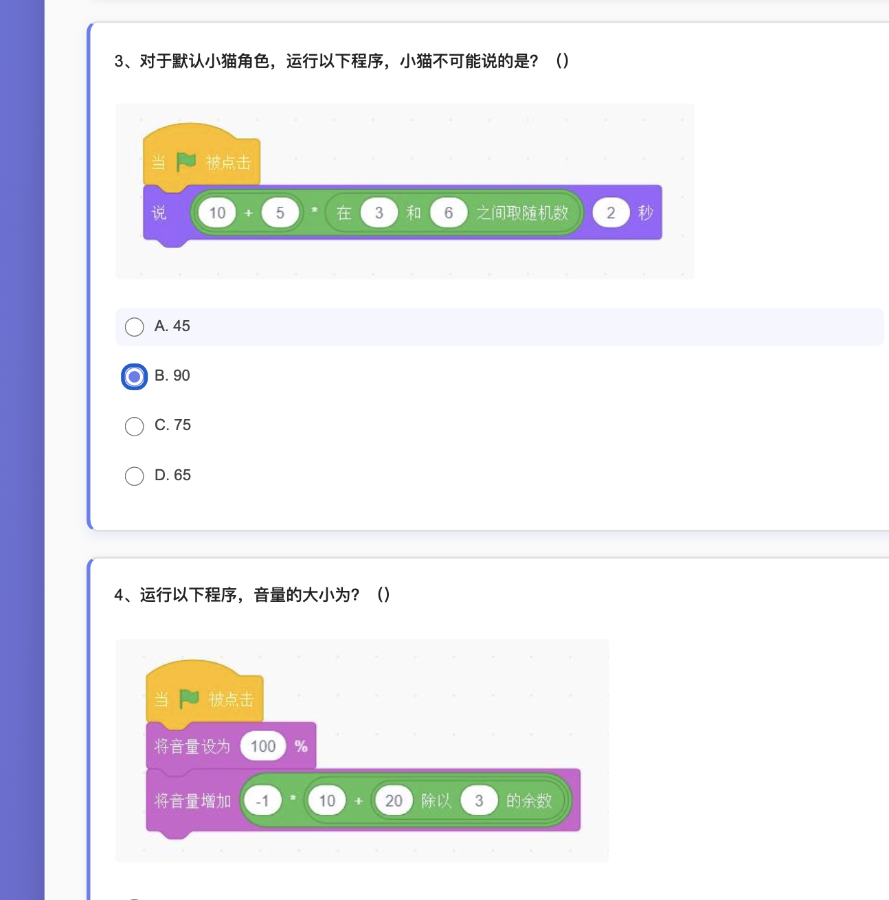
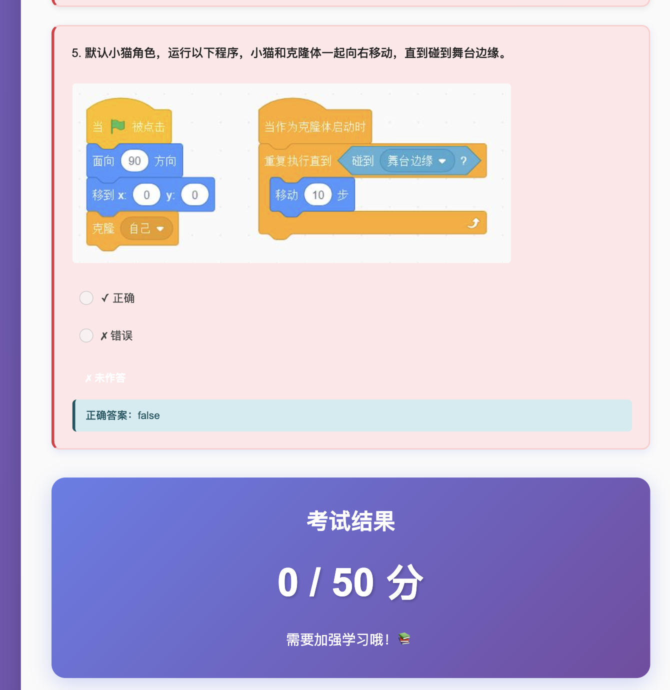

# GESP 图形化二级考试系统

这是一个基于 Web 的 GESP（全国青少年软件编程等级考试）图形化二级考试在线测试系统。

## 项目简介

本项目实现了 2023年3月 GESP 图形化二级考试的完整试卷，包括：
- 单选题（10题，每题3分，共30分）
- 判断题（5题，每题4分，共20分）
- 编程题（2题，每题25分，共50分）

## 实现

1. 使用 Calibre 转换成 htmlz 格式
2. 解压后生成 html 文件
    - 有部分图片不对，需要自己更新
3. 再使用 AI 功能做成网站

## 功能特点

- ✨ 现代化的界面设计，渐变色背景和卡片式布局
- 📝 完整的考试题目，包含图片展示
- ⚡ 实时答题反馈，自动评分
- 🎯 答案解析，显示正确答案
- 📊 成绩统计和评价
- 💻 响应式设计，支持多种设备

## 截图展示

### 考试界面


### 答题结果


## 使用方法

1. 克隆或下载本项目
2. 直接在浏览器中打开 `index.html` 文件
3. 开始答题
4. 完成后点击"提交试卷"查看成绩

## 技术栈

- HTML5
- CSS3（渐变、动画、响应式布局）
- JavaScript（原生 JS）

## 项目结构

```
GESP_Test/
├── index.html          # 主页面
├── style.css           # 样式文件（已内联到 HTML）
├── images/             # 题目图片资源
├── screenshots/        # 项目截图
└── README.md          # 项目说明
```

## 考试说明

- 总分：100分
- 考试时间：60分钟
- 题型：单选题、判断题、编程题
- 适用对象：GESP 图形化二级考生

## GitHub

<https://github.com/build-your-own-x-with-ai/GESP_Test>

## 许可证

本项目仅供学习交流使用。